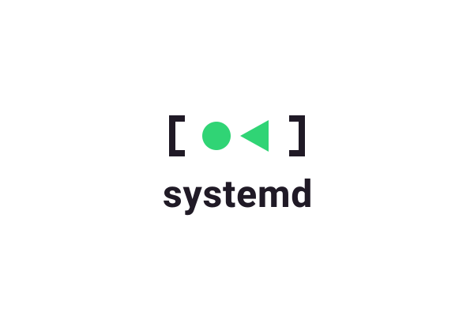
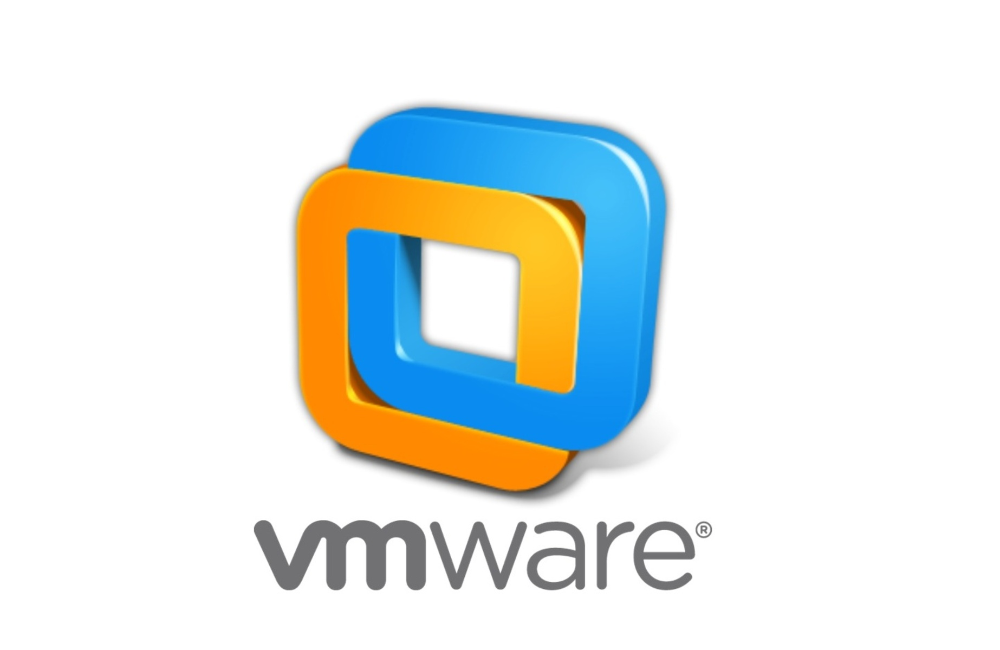
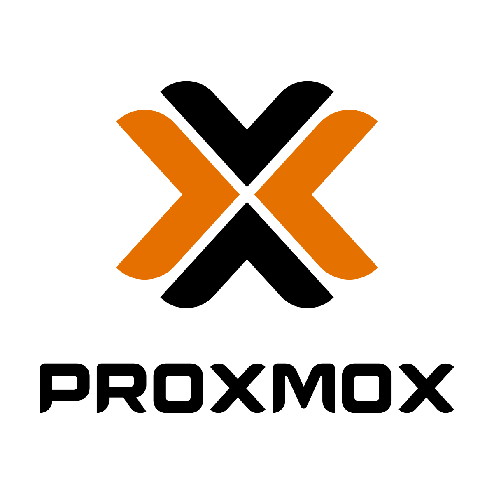
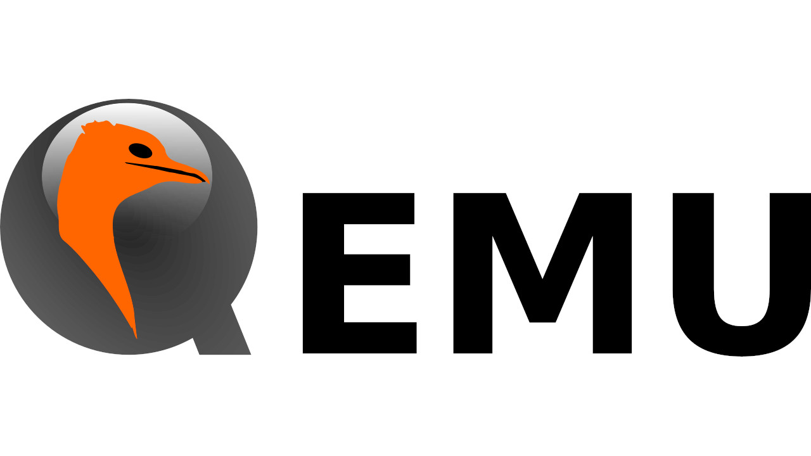
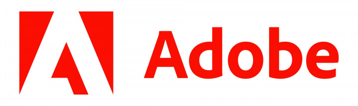
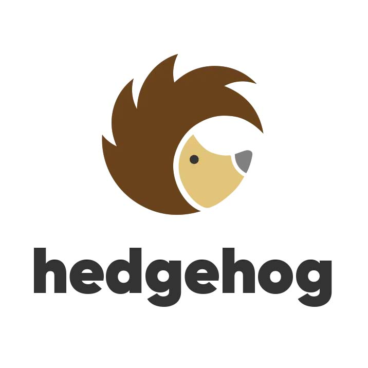

<!-- _class: cover -->
<!-- _paginate: false -->

# Flatcar Linux: Provisioned, Not Installed

## A declarative and Immutable Operating Systems for Containers and Kubernetes

##### Jan Bronicki

---

<!-- _class: sidebar whoami -->

# whoami

<div class="pin-tr" style="display: flex; gap: 20px; align-items: center">
  
  
</div>


## Jan Bronicki

Flatcar Maintainer

Software Engineer @ Microsoft


<p class="bio-github">@John15321</p>

---

<!-- _class: agenda -->

# Agenda

- The community behind Flatcar
- What Flatcar Container Linux actually is
- The UX philosophy — functionality, not features
- Immutable by design & A/B updates
- Live demo

---

<!-- _class: section -->

# Community Stewarded

## What that means, and who we are

---

<!-- _class: sidebar -->

# The community

<div style="position: relative; width: 100%; height: 620px; margin-top: 4px">
  
  
  
  
  
  
  
</div>

---

<!-- _class: sidebar -->

# We work with

- **Gentoo** and **Fedora CoreOS**
- **systemd**, **Dracut**, **Grub**, **Afterburn**
- Openwall **oss-security** non-disclosure list
- Co-founders of the **UAPI Group** — cross-distro SIG for image-based Linux

<div class="row row-center" style="margin-top: 24px; gap: 70px">
  
  
  
  
</div>

---

<!-- _class: sidebar -->

# Runs everywhere

<div style="position: relative; width: 100%; height: 580px; margin-top: 4px">
  
  
  
  

  
  
  
  

  
  
  
  
  

  
  
  
  
</div>

---

<!-- _class: sidebar -->

# In production at

<div style="position: relative; width: 100%; height: 560px; margin-top: 8px">
  
  
  
  

  
  
  
  

  
  
  
</div>

---

<!-- _class: section -->

# How Flatcar Works

## What is it, and how do you use it?

---

# Flatcar?


---

# Flatcar!


---

<!-- _class: lead -->

# The UX we chose

<div class="cols-2" style="gap: 60px; margin-top: 20px; align-items: end">

<div style="text-align: center">
  <div style="position: relative">
    
    <svg viewBox="0 0 100 100" preserveAspectRatio="none" style="position: absolute; inset: 0; width: 100%; height: 100%; pointer-events: none">
      <line x1="2" y1="2" x2="98" y2="98" stroke="#e53935" stroke-width="4"/>
      <line x1="98" y1="2" x2="2" y2="98" stroke="#e53935" stroke-width="4"/>
    </svg>
  </div>
  <p style="font-weight: 700; margin: 12px 0 0 0">General-purpose Linux</p>
</div>

<div style="text-align: center">
  
  <p style="font-weight: 700; margin: 12px 0 0 0">Flatcar</p>
</div>

</div>

---

<!-- _class: sidebar -->

# Functionality, not Features

<div class="cols-2" style="align-items: start; gap: 40px; margin-top: 12px">

<div>

**General-purpose Linux**

- Choose your shell, desktop, stack
- Backports vs. new repos vs. waiting
- Think about *features*
- Build the system you want

</div>

<div>

**Flatcar**

- We choose for you — no pkg manager
- Whole OS updates automatically
- Think about *functionality* — does it work?
- We deliver a light switch

</div>

</div>

---

<!-- _class: sidebar -->

# Provisioned, not Installed

<div class="cols-2" style="align-items: start; gap: 40px; margin-top: 12px">

<div>

**Install**

- Interactive choices during setup
- Each machine ends up a little different
- The image and the config are one blob

</div>

<div>

**Provision**

- One declarative config, applied at boot
- Every machine is identical
- Same idea as containers

</div>

</div>

---

<!-- _class: lead -->

# You don't install Flatcar.

## You provision it.

---

# Flatcar UX

<div class="row row-center" style="gap: 24px; margin-top: 100px; flex-wrap: nowrap; align-items: center">

  <div style="flex: 1; padding: 32px 24px; border: 3px solid #12172B; border-radius: 14px; text-align: center; box-shadow: 6px 6px 0 #09BAC8; background: #FFFFFF">
    <div style="font-size: 30px; font-weight: 700">Butane YAML</div>
    <div style="font-size: 20px; margin-top: 8px; opacity: 0.7">Declarative config</div>
  </div>

  <div style="color: #09BAC8; font-size: 56px; font-weight: 700; flex-shrink: 0">→</div>

  <div style="flex: 1; padding: 32px 24px; border: 3px solid #12172B; border-radius: 14px; text-align: center; box-shadow: 6px 6px 0 #09BAC8; background: #FFFFFF">
    <div style="font-size: 26px; font-weight: 700">Cloud · VM · Bare Metal</div>
    <div style="font-size: 20px; margin-top: 8px; opacity: 0.7">Provisions</div>
  </div>

  <div style="color: #09BAC8; font-size: 56px; font-weight: 700; flex-shrink: 0">→</div>

  <div style="flex: 1; padding: 32px 24px; border: 3px solid #12172B; border-radius: 14px; text-align: center; box-shadow: 6px 6px 0 #09BAC8; background: #FFFFFF">
    <div style="font-size: 30px; font-weight: 700">Containers</div>
    <div style="font-size: 20px; margin-top: 8px; opacity: 0.7">Podman · K8s · systemd</div>
  </div>

</div>

---

# What Butane looks like

```yaml
# Butane config header — declares this is a Flatcar config
variant: flatcar
version: 1.0.0

# Drop in a systemd unit — Flatcar installs and starts it at first boot
systemd:
  units:
    - name: nginx.service
      enabled: true
      contents: |
        [Service]
        ExecStart=/usr/bin/docker run --rm -p 80:80 nginx
        [Install]
        WantedBy=multi-user.target
```


---

# Boot it in a VM

```console
# Transpile Butane to an ignition config (JSON)
$ butane -o config.ign config.bu

# Boot Flatcar in QEMU with it applied
$ ./flatcar_production_qemu.sh -i config.ign
```

One YAML file in. One running machine out.

---

# …and after first boot

```console
$ systemctl is-active nginx.service
active

$ curl -sI http://localhost
HTTP/1.1 200 OK
Server: nginx/1.27.3
Content-Type: text/html
```

No SSH. No manual `docker run`. The machine came up already serving.

---

<!-- _class: sidebar -->

# Immutable by Design

- **First boot** provisions from config. After that: the base OS doesn't change.
- The OS is **read-only** and **dm-verity protected**.
- **No package updates** — the entire OS updates as one unit.
- Same config + same base image = **identical machine every time**.
- **sysexts** for optional add-ons.

---

<!-- _class: sidebar -->

# A/B Updates


- Verified image staged to the **inactive partition**
- **Reboot** activates the new OS
- **Rollback** = reboot back to the old partition
- **No intermediate states** — it works, or it rolls back

---

<!-- _class: sidebar -->

# Channels


- **Alpha** — fully tested, may have incomplete features. Developers.
- **Beta** — production-ready. Canary alongside stable.
- **Stable** — widespread production. Promoted from beta.
- **LTS** — slower-moving track for environments that need it.

---

<!-- _class: lead -->

# Demos!

## github.com/John15321/SesjaLinuksowa

---

<!-- _class: sidebar -->

# Come find us

<div class="cols-2" style="align-items: start; gap: 32px">

<div>

**Online**

- **flatcar.org**
- **github.com/flatcar**
- **Discord**

</div>

<div>

**Meetings**

- **Office hours** — 2nd Tuesday, 2:30pm UTC
- **Dev Sync** — 4th Tuesday, 2:30pm UTC

</div>

</div>

Jump in — first-time contributors welcome.

---

<!-- _class: closing -->
<!-- _paginate: false -->

# Thank you!

<p class="closing-links">
  <a href="https://flatcar.org"> flatcar.org</a>
  <a href="https://github.com/flatcar"> github.com/flatcar</a>
  <a href="https://discord.gg/PMYjFUsJyq"> discord.gg/PMYjFUsJyq</a>
</p>

*Questions?*
