<!-- _class: cover -->
<!-- _paginate: false -->

# Flatcar Linux: Provisioned, Not Installed

## A declarative and Immutable Operating Systems for Containers and Kubernetes

##### Jan Bronicki

---

<!-- _class: sidebar whoami -->

# whoami

<div class="pin-tr" style="display: flex; gap: 20px; align-items: center">
  
  
</div>


## Jan Bronicki

Flatcar Maintainer

Software Engineer @ Microsoft


<p class="bio-github">@John15321</p>

---

<!-- _class: agenda -->

# Agenda

- The community behind Flatcar
- What Flatcar Container Linux actually is
- Provisioned, not installed
- Immutable by design & A/B updates
- Live demo

---

<!-- _class: section -->

# Community Stewarded

## What that means, and who we are

---

<!-- _class: sidebar -->

# Community stewarded

- **Fully open, fully free:** Apache 2.0, public roadmap, public issue tracker
- **No single owner:** the project and trademark belong to the CNCF and the Linux Foundation
- **CNCF project:** neutral governance under the Cloud Native Computing Foundation
- **You can join:** SIG meetings are public; anyone can propose changes or maintain

<div class="cncf-banner">
  <p class="cncf-banner-caption">Flatcar is a <strong>CNCF</strong> project</p>
  
</div>

---

<!-- _class: sidebar -->

# The community

<div style="position: relative; width: 100%; height: 620px; margin-top: 4px">
  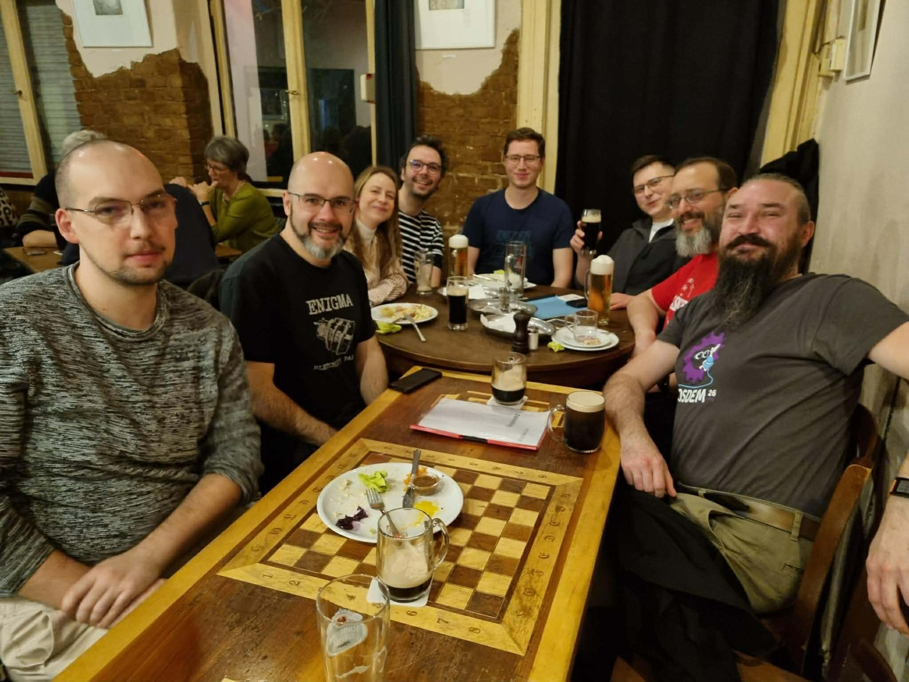
  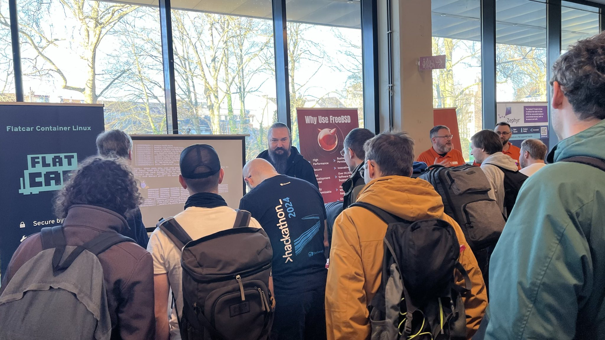
  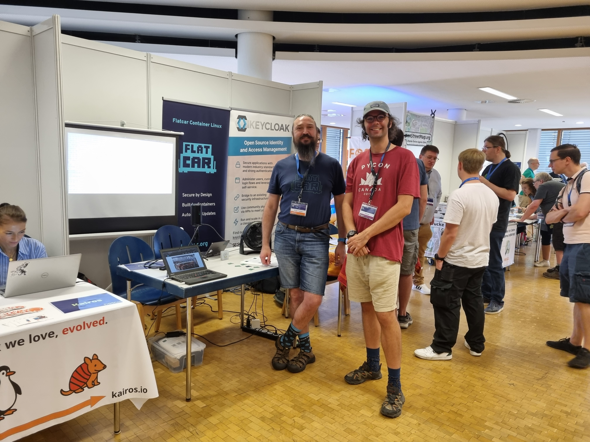
  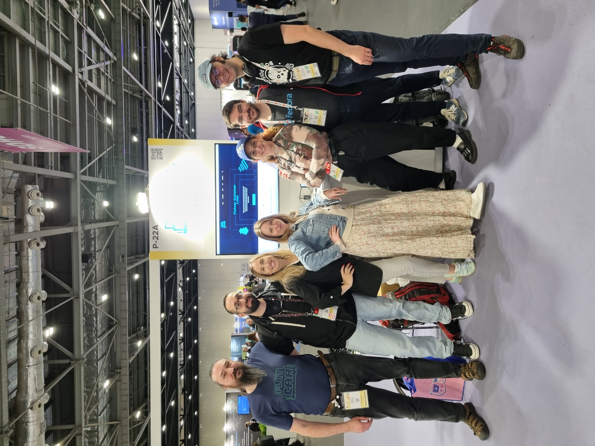
  
  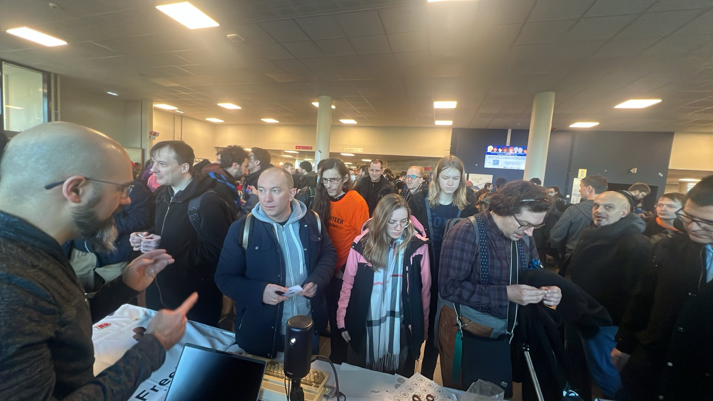
  
</div>

---

<!-- _class: sidebar -->

# We work with

- **Gentoo** and **Fedora CoreOS**
- **systemd**, **Dracut**, **Grub**, **Afterburn**
- Openwall **oss-security** non-disclosure list
- Co-founders of the **UAPI Group**, cross-distro SIG for image-based Linux

<div class="logo-wall logo-wall-lg" style="grid-template-columns: repeat(4, 1fr); margin-top: 18px">
  
  
  
  
</div>

---

<!-- _class: sidebar -->

# Runs everywhere

<div class="logo-wall" style="grid-template-columns: repeat(5, 1fr); grid-template-rows: repeat(4, 1fr); gap: 20px 28px; height: 530px; margin-top: 8px">
  
  
  
  
  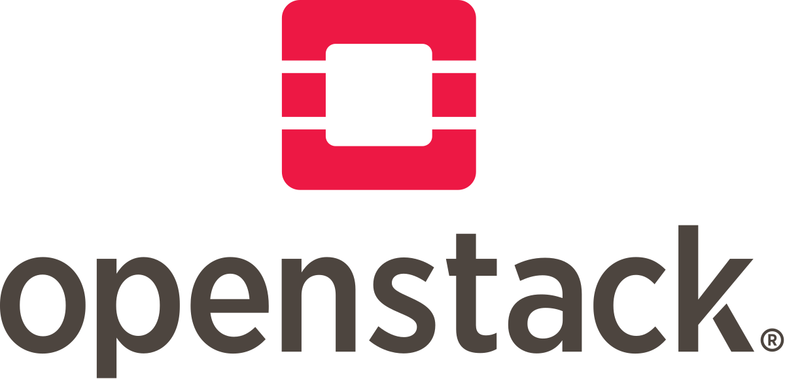

  
  
  
  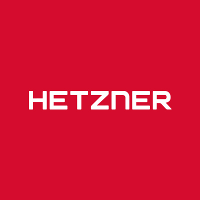
  

  
  
  
  

  
  
  
  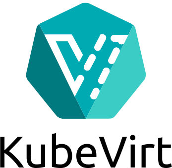
  
  
</div>

---

<!-- _class: sidebar -->

# In production at

<div class="logo-wall logo-wall-lg" style="grid-template-columns: repeat(5, 1fr); grid-template-rows: repeat(3, 1fr); gap: 20px 32px; height: 530px; margin-top: 8px">
  
  
  
  
  

  
  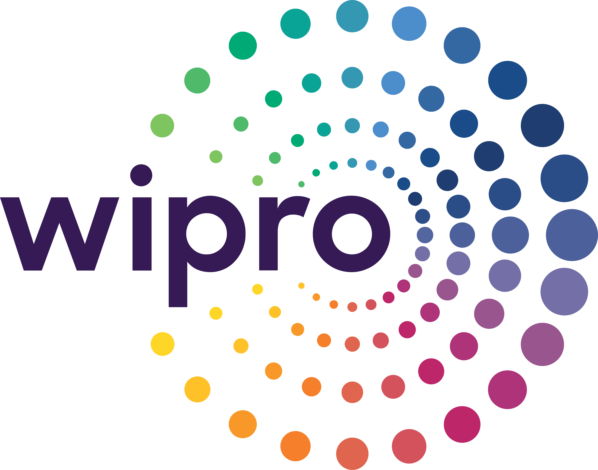
  
  
  

  
  
  
  
  
</div>

---

<!-- _class: section -->

# How Flatcar Works

## What is it, and how do you use it?

---

# Flatcar?

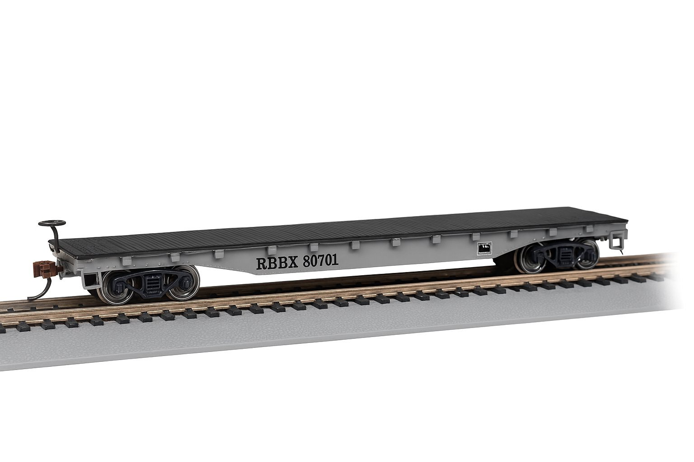

---

# Flatcar!

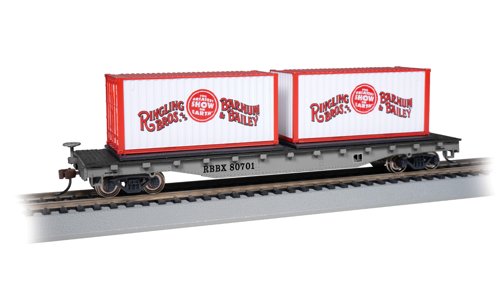

---

<!-- _class: lead -->

# The UX we chose

<div class="cols-2" style="gap: 60px; margin-top: 20px; align-items: end">

<div style="text-align: center">
  <div style="position: relative">
    
    <svg viewBox="0 0 100 100" preserveAspectRatio="none" style="position: absolute; inset: 0; width: 100%; height: 100%; pointer-events: none">
      <line x1="2" y1="2" x2="98" y2="98" stroke="#e53935" stroke-width="4"/>
      <line x1="98" y1="2" x2="2" y2="98" stroke="#e53935" stroke-width="4"/>
    </svg>
  </div>
  <p style="font-weight: 700; margin: 12px 0 0 0">General-purpose Linux</p>
</div>

<div style="text-align: center">
  
  <p style="font-weight: 700; margin: 12px 0 0 0">Flatcar</p>
</div>

</div>

---

<!-- _class: lead -->

# You don't install Flatcar.

## You provision it.

---

<!-- _class: sidebar -->

# Provisioned, not Installed

<div class="cols-2" style="align-items: start; gap: 40px; margin-top: 12px">

<div>

**Traditional install**

- Interactive choices during setup
- Every machine ends up a little different
- Manual updates, package churn, drift
- No separation between OS and config

</div>

<div>

**Flatcar: provisioned**

- One declarative config, applied at boot
- Every machine identical, reproducible
- Whole-OS atomic updates, no drift
- Same idea as containers

</div>

</div>

---

# Flatcar Workflow

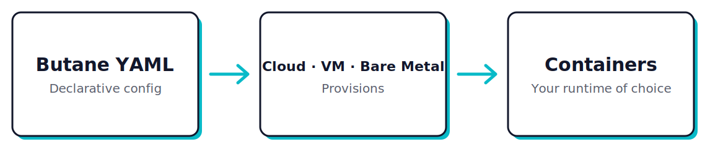

---

# What Butane looks like

```yaml
# Butane config header: declares this is a Flatcar config
variant: flatcar
version: 1.0.0

# Drop in a systemd unit. Flatcar installs and starts it at first boot
systemd:
  units:
    - name: nginx.service
      enabled: true
      contents: |
        [Service]
        ExecStart=/usr/bin/docker run --rm -p 80:80 nginx
        [Install]
        WantedBy=multi-user.target
```


---

# Boot it in a VM

```bash
# Transpile Butane to an ignition config (JSON)
$ butane -o config.ign config.bu

# Boot Flatcar in QEMU with the config applied
$ ./flatcar_production_qemu.sh -i config.ign
```


<div class="callout">
The config gets handed to Flatcar as <strong>user-data</strong>. Same channel every major cloud, hypervisor, and bare-metal provisioner uses to seed an instance.
</div>

---

# It came up serving

```console
$ systemctl is-active nginx.service
active

$ curl -sI http://localhost
HTTP/1.1 200 OK
Server: nginx/1.27.3
Content-Type: text/html
```

No login. No post-boot setup. The machine came up already doing its job.

---

<!-- _class: sidebar -->

# Immutable by Design

- **First boot** provisions from config. After that: the base OS doesn't change.
- The OS is **read-only** and **dm-verity protected**.
- **No package updates**: the entire OS updates as one unit.
- Same config + same base image = **identical machine every time**.
- **sysexts** for optional add-ons.

---

<!-- _class: sidebar -->

# A/B Updates

<div class="ab-slide">
<div class="ab-wrap">
  <div class="ab-stack">
    <div class="ab-card">
      <div class="ab-title"><span class="ab-num">1</span>Fresh install</div>
      <div class="ab-slots">
        <div class="ab-slot active"><span class="ab-label">A</span><span class="ab-ver">1.2.3</span></div>
        <div class="ab-slot passive"><span class="ab-label">B</span><span class="ab-ver">1.2.3</span></div>
      </div>
      <div class="ab-caption">Image ships both slots identical. Only true at first boot.</div>
    </div>
    <div class="ab-card">
      <div class="ab-title"><span class="ab-num">2</span>Update staged</div>
      <div class="ab-slots">
        <div class="ab-slot active"><span class="ab-label">A</span><span class="ab-ver">1.2.3</span></div>
        <div class="ab-slot staged"><span class="ab-label">B</span><span class="ab-ver">1.2.4</span></div>
      </div>
      <div class="ab-caption">New image written over the passive slot. No downtime.</div>
    </div>
    <div class="ab-card">
      <div class="ab-title"><span class="ab-num">3</span>Reboot swaps</div>
      <div class="ab-slots">
        <div class="ab-slot passive"><span class="ab-label">A</span><span class="ab-ver">1.2.3</span></div>
        <div class="ab-slot active"><span class="ab-label">B</span><span class="ab-ver">1.2.4</span></div>
      </div>
      <div class="ab-caption">Boot flips to B. If it fails, reboot back to A at 1.2.3.</div>
    </div>
    <div class="ab-card">
      <div class="ab-title"><span class="ab-num">4</span>Steady running</div>
      <div class="ab-slots">
        <div class="ab-slot passive"><span class="ab-label">A</span><span class="ab-ver">1.2.3</span></div>
        <div class="ab-slot active"><span class="ab-label">B</span><span class="ab-ver">1.2.4</span></div>
      </div>
      <div class="ab-caption">B live. A untouched: it's your rollback target.</div>
    </div>
    <div class="ab-card">
      <div class="ab-title"><span class="ab-num">5</span>Next update</div>
      <div class="ab-slots">
        <div class="ab-slot staged"><span class="ab-label">A</span><span class="ab-ver">1.2.5</span></div>
        <div class="ab-slot active"><span class="ab-label">B</span><span class="ab-ver">1.2.4</span></div>
      </div>
      <div class="ab-caption">1.2.5 overwrites the old 1.2.3 on A. Next reboot: A active, B rollback.</div>
    </div>
  </div>
  <div class="ab-cycle-icon" aria-hidden="true">
    <svg viewBox="0 0 100 100" xmlns="http://www.w3.org/2000/svg"><path d="M 50 12 A 38 38 0 1 1 12 50" fill="none" stroke="#12172B" stroke-width="7" stroke-linecap="round"/><polygon points="12,32 3,52 21,52" fill="#12172B"/></svg>
  </div>
</div>
<div class="ab-cycle">↺ The passive slot is <strong>never auto-synced</strong>. It's your rollback until the next update lands.</div>
</div>

---


# Channels

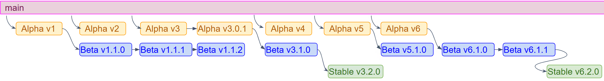

- **Alpha**: fully tested, may have incomplete features. Developers.
- **Beta**: production-ready. Canary alongside stable.
- **Stable**: widespread production. Promoted from beta.
- **LTS**: slower-moving track for environments that need it.

<div class="callout">
Every commit runs the full test suite: unit, integration, and product tests across every supported cloud. By the time a version ships, even <strong>Alpha</strong>, it's been through hundreds of runs.
</div>

---

<!-- _class: lead -->

# Demos!

## github.com/John15321/demos

---

<!-- _class: closing -->
<!-- _paginate: false -->

# Thank you!

<p class="closing-qr-caption"> Join our Discord!</p>

<p class="closing-links">
  <a href="https://flatcar.org"> flatcar.org</a>
  <a href="https://github.com/flatcar"> github.com/flatcar</a>
  <a href="https://discord.gg/PMYjFUsJyq"> discord.gg/PMYjFUsJyq</a>
</p>

<p class="closing-meetings">
  <span><strong>Office hours</strong> · every 2nd Tue, 16:30 CEST</span>
  <span><strong>Dev sync</strong> · every 4th Tue, 16:30 CEST</span>
</p>

<p class="closing-cta"><strong>Everyone welcome.</strong> Users, contributors, or just curious. Ask questions, get help, share what you're building!</p>
